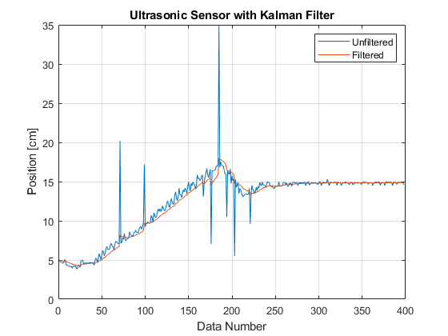

# Grabby ArmBoy

C++ code developed to control the robotic arm Grabby Arm Boy using Arduino.

## Presentation

Please visit: https://portfolium.com/entry/grabby-arm-boy-grab for the presentation on how this code was developed.

## Kalman Filter

A Kalman filter was implemented to filter out the noise from the data recieved from the ultrasonic sensor. Below is the result:

